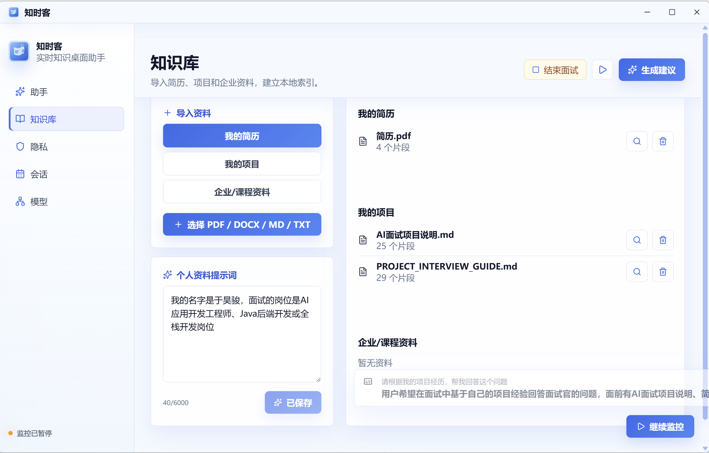
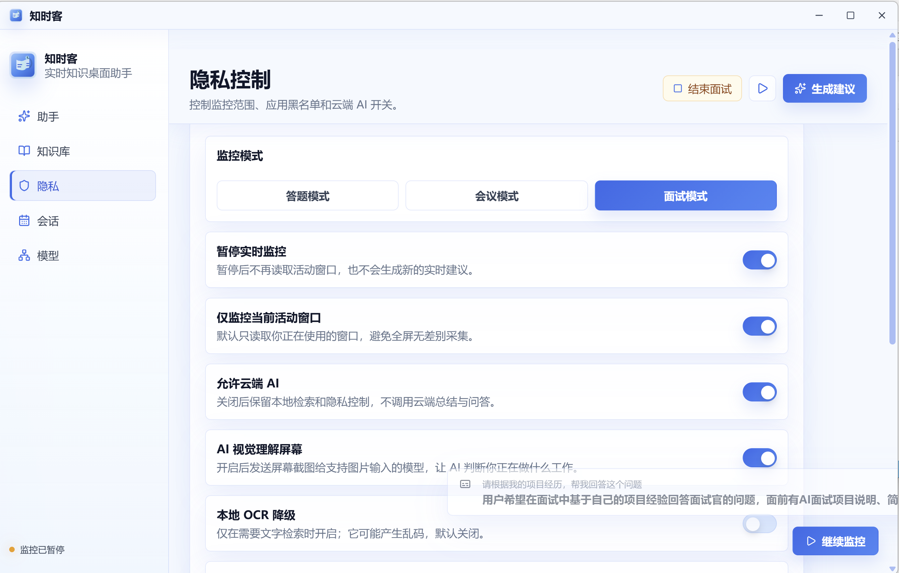
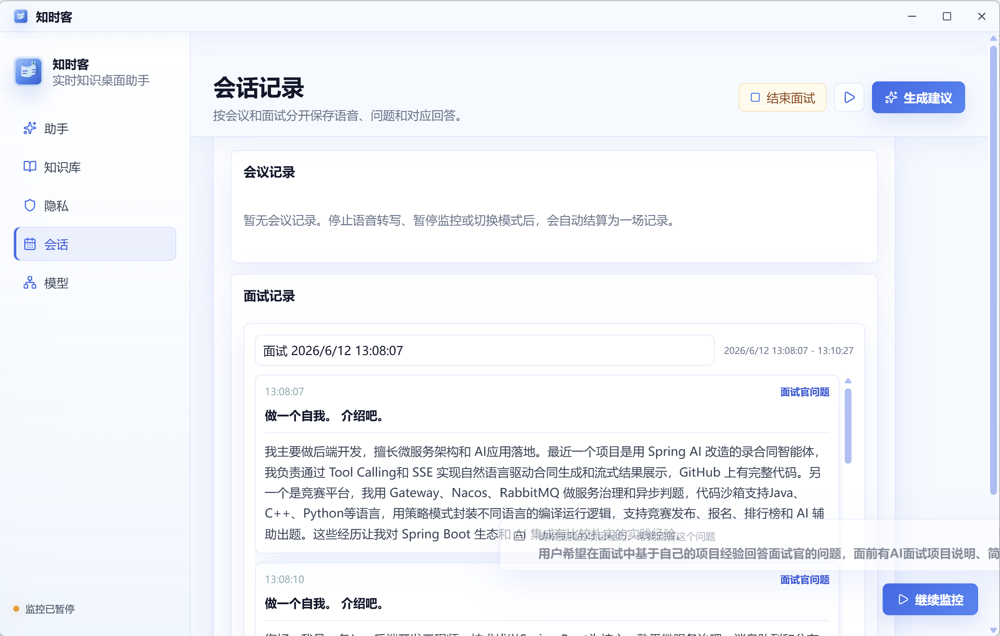
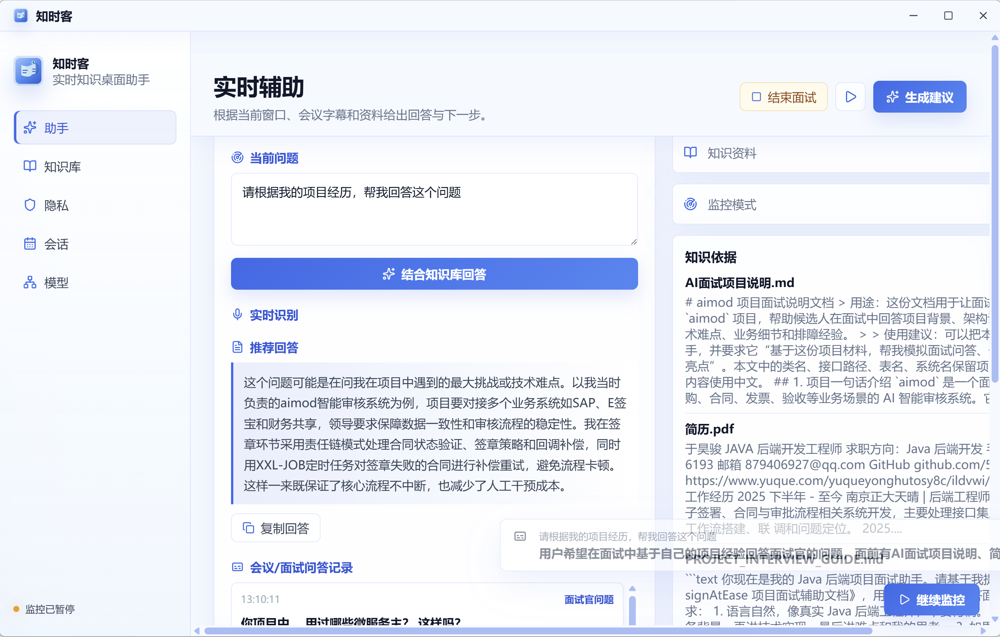
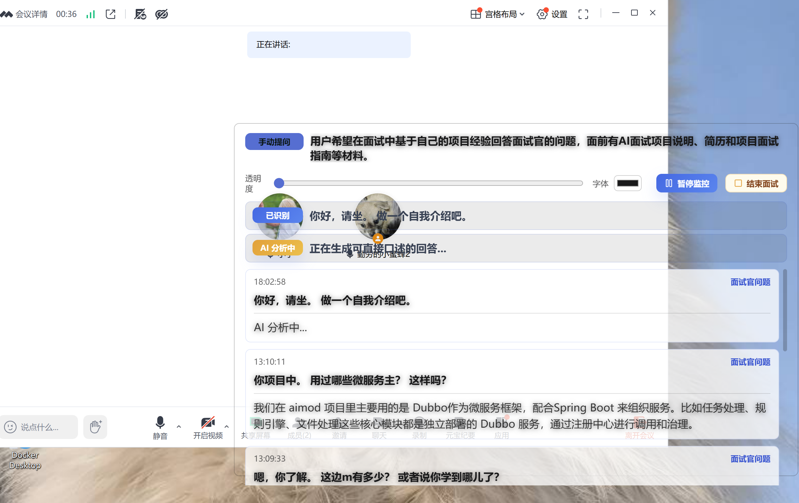
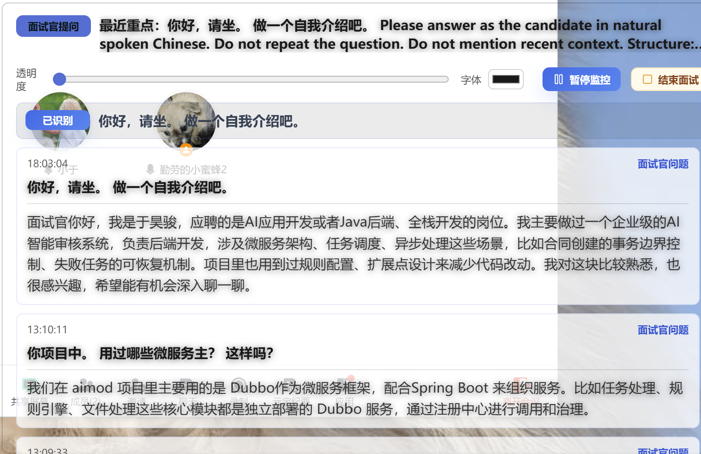
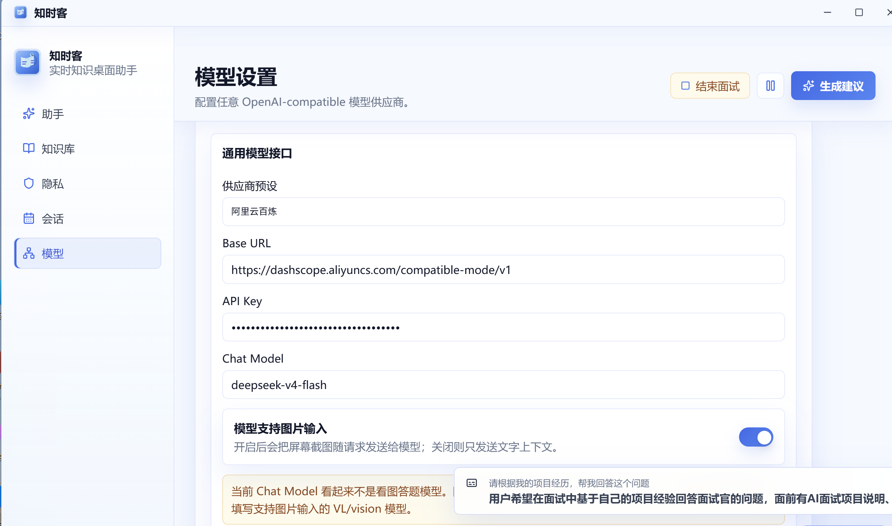
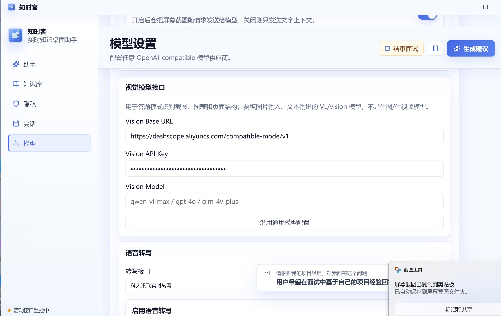
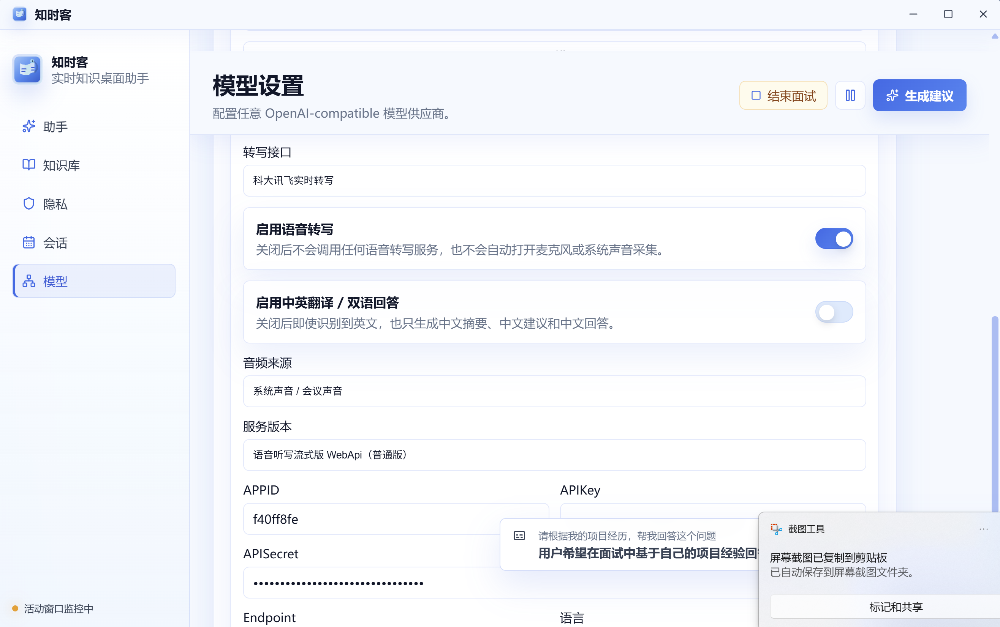

# 知时客

知时客是一款基于 Electron + React + TypeScript 的实时知识桌面助手。它可以导入个人简历、项目资料、企业资料和面试素材，在答题、会议、面试等场景中结合知识库、屏幕内容和语音转写，生成可直接参考的回答建议。

## 示例图











## 主要功能

- 实时辅助：根据当前窗口、会议字幕、语音转写和知识库生成回答建议。
- 本地知识库：支持导入 PDF、DOCX、Markdown、TXT，按简历、项目、企业/课程资料分类管理。
- 个人资料提示词：在知识库页补充个人背景、项目职责、技术栈和表达偏好，让回答更贴合个人经历。
- 答题模式：识别屏幕题目，结合视觉模型和知识库生成解题思路或答案。
- 会议模式：转写会议音频，提炼重点、待办事项和可复述的回复。
- 面试模式：识别面试官问题，按候选人口吻生成自然回答。
- 回答风格：支持简洁版、面试官友好版、技术深入版、项目复盘版、英文版。
- 悬浮建议条：支持桌面悬浮展示、拖动、滚动、暂停/继续监控、结束当前会议或面试，并支持窗口缩放。
- 隐私控制：支持暂停监控、黑名单、活动窗口监控、视觉理解开关和悬浮条样式配置。
- 本地记录：配置、知识库索引、会话记录等保存在本机，便于备份和排查。

## 最新行为说明

- 面试或会议结束后，实时面板和悬浮窗会清空当前内容，历史内容只保留在“会话”页记录中。
- 面试/会议模式只保留一条正在生成的流式回答，避免“AI 分析中输出一遍，完成后又重复输出一遍”。
- 英文版回答风格会先输出英文回答，再在下方输出对应中文回答；用户输入可以是中文或英文。
- 回答风格会在主窗口和悬浮窗口保持一致，点击继续监控后不会自动回到简洁版。

## 环境要求

- Node.js 20 或更高版本
- Windows 10/11
- macOS 可打包 DMG/ZIP，但语音、截图和窗口权限需要按系统提示授权
- 可选：支持 OpenAI-compatible API 的大语言模型服务
- 可选：支持图像输入的 VL/vision 模型，用于答题模式和屏幕理解
- 可选：语音听写或实时语音转写服务，用于会议/面试语音转写

## 安装与运行

```powershell
git clone https://github.com/51522yhj/zhishike.git
cd zhishike
npm install
npm run dev
```

构建生产版本：

```powershell
npm run build
```

打包 Windows 可运行目录：

```powershell
npm run dist:win
```

打包后可执行文件位于：

```text
release/zhishike-win32-x64/知时客.exe
```

打包 macOS 安装包：

```bash
npm run dist:mac
```

macOS 产物位于 `release/` 目录，通常包含 DMG 和 ZIP。未签名构建首次打开时可能需要在“系统设置 -> 隐私与安全性”中允许运行。

## 基本使用

1. 打开应用后进入“模型”页，填写通用模型的 Base URL、API Key 和模型名。
2. 如果需要答题模式或屏幕理解，填写支持图片输入的视觉模型配置。
3. 如果需要会议/面试转写，开启语音转写并填写对应服务密钥。
4. 进入“知识库”页，选择资料分类并导入简历、项目文档或企业资料。
5. 在“个人资料提示词”中补充你的个人背景、项目职责、技术栈、回答风格和希望强调的内容。
6. 回到“助手”页，点击“生成建议”，或在隐私页切换答题、会议、面试模式。
7. 在会议或面试过程中，可以随时点击“结束会议”或“结束面试”，实时内容会清空，完整记录可在“会话”页查看。

## 回答风格

| 风格 | 适用场景 | 输出特点 |
| --- | --- | --- |
| 简洁版 | 快速答复、实时辅助 | 直接给结论和关键点。 |
| 面试官友好版 | 面试问答 | 口语自然，突出候选人真实经历。 |
| 技术深入版 | 技术追问、方案解释 | 强调架构、原理、边界和取舍。 |
| 项目复盘版 | 项目经历、STAR 复盘 | 按背景、行动、结果组织回答。 |
| 英文版 | 英文面试或双语准备 | 先输出 `English:`，再输出 `Chinese:` 对应中文表达。 |

## 模型配置说明

### 通用对话模型

用于实时辅助、知识库问答、会议总结、面试回答等文字生成。

需要填写：

- Base URL：OpenAI-compatible API 地址，例如 `https://api.openai.com/v1`
- API Key：模型服务密钥
- Chat Model：模型名称，例如 `gpt-4o-mini`、`qwen-plus`、`deepseek-chat`

环境变量示例：

```powershell
$env:OPENAI_API_KEY="你的 API Key"
$env:OPENAI_BASE_URL="https://api.openai.com/v1"
$env:OPENAI_CHAT_MODEL="gpt-4o-mini"
npm run dev
```

### 视觉模型

用于答题模式和屏幕视觉理解。必须选择支持图片输入的 VL/vision 模型，不要填写图片生成模型。

常见示例：

- OpenAI：`gpt-4o`、`gpt-4.1`
- 阿里云百炼：`qwen-vl-plus-latest`
- 其他 OpenAI-compatible 视觉模型

### 语音转写模型

用于会议模式和面试模式。

当前支持：

- OpenAI-compatible `/audio/transcriptions`
- 语音听写或实时语音转写服务

常见配置项：

- APPID
- APIKey
- APISecret
- Endpoint
- 语言
- 领域

语音转写密钥需要来自对应的语音转写服务。不同模型、不同控制台服务的额度和授权可能不通用，请以服务商实际开通页面为准。

## 各模式需要的模型

| 模式 | 必需模型 | 可选模型 | 说明 |
| --- | --- | --- | --- |
| 实时辅助 | 通用对话模型 | 视觉模型、知识库 | 有视觉模型时可结合屏幕截图理解当前工作。 |
| 答题模式 | 视觉模型 | 通用对话模型、知识库 | 需要看图识别题目，建议配置 VL/vision 模型。 |
| 会议模式 | 语音转写模型、通用对话模型 | 知识库、个人资料提示词 | 用于会议语音转写、总结和生成可回复内容。 |
| 面试模式 | 语音转写模型、通用对话模型 | 知识库、个人资料提示词 | 根据面试官问题生成候选人口吻回答。 |
| 知识库问答 | 通用对话模型 | 个人资料提示词 | 导入资料越完整，回答越贴合个人经历。 |

## 知识库搜索实现

知识库检索是本地轻量 RAG 实现，不依赖外部向量数据库，也不会调用额外的 embedding API。核心代码位于 `src/main/knowledge.ts`、`src/main/vector.ts` 和 `src/main/database.ts`。

导入资料时会先抽取文本：

- `.docx` 使用 `mammoth.extractRawText`
- `.pdf` 使用 `pdf-parse`
- Markdown、TXT 等文本文件按 UTF-8 读取

抽取后的文本会做基础清洗，然后按中文/英文句号、问号、感叹号和空行分块。每个 chunk 大约控制在 `900` 字以内；如果无法正常分块，会取前 `1200` 字作为兜底 chunk。

每个 chunk 会生成一个本地 `96` 维哈希向量：

- 英文和数字按词切分
- 中文会拆成单字和相邻二字词
- 每个 token 用哈希映射到 96 维数组
- 向量会做 L2 归一化，便于计算余弦相似度

搜索时会把当前问题、语音转写、屏幕文字和个人提示词组合成查询文本，生成同样的本地向量，然后和所有知识库 chunk 做余弦相似度排序。默认返回最相关的前几条片段作为 `citations`，再传给通用对话模型生成回答。

这个方案的优点是简单、离线、成本低、部署方便；缺点是语义理解能力弱于真正的大模型 embedding，更接近增强版关键词相似度。资料量较大或需要更强语义检索时，可以后续替换为 OpenAI embedding、bge/m3e 等本地 embedding 模型，或接入 SQLite FTS、LanceDB、Qdrant、Milvus 等检索方案。

## 存储位置

### Windows

```text
C:\zhishike\records\assistant-db.json
C:\zhishike\records\runtime.log
C:\zhishike\screenshots\
```

### macOS

```text
~/Documents/zhishike/records/assistant-db.json
~/Documents/zhishike/records/runtime.log
~/Documents/zhishike/screenshots/
```

### Linux

```text
~/zhishike/records/assistant-db.json
~/zhishike/records/runtime.log
~/zhishike/screenshots/
```

### Windows 与 macOS 的区别

- Windows 默认写入 `C:\zhishike`，便于直接定位日志、截图和数据库。
- macOS 默认写入当前用户的 `~/Documents/zhishike`，更符合 macOS 沙盒外文档目录习惯。
- Windows 通常不需要额外授予屏幕录制权限；macOS 首次使用截图、语音、窗口识别时，可能需要在系统隐私设置中授权。
- 两个平台的主要数据结构一致，迁移时可以备份 `records/assistant-db.json` 和需要保留的截图目录。

`assistant-db.json` 中保存知识库索引、模型配置、隐私设置、会话记录、个人资料提示词等数据。请不要把包含真实密钥的本地数据上传到公开仓库。

## 快捷键

- `Ctrl+Shift+Space`：显示/隐藏助手窗口
- `Ctrl+Shift+P`：暂停/继续监控
- `Ctrl+Shift+S`：跳转到实时辅助视图

## 开发脚本

```powershell
npm run dev        # 开发模式
npm run typecheck  # TypeScript 类型检查
npm run build      # 构建主进程和渲染进程
npm run dist:win   # 打包 Windows 可运行目录
npm run dist:mac   # 打包 macOS DMG/ZIP
```

回答风格回归验证：

```powershell
node scripts/verify-answer-style.mjs
```

如果要验证已打包的 Windows 程序，可以把 exe 路径作为参数传入：

```powershell
node scripts/verify-answer-style.mjs "release/zhishike-win32-x64/知时客.exe"
```

## 项目结构

```text
src/main/       Electron 主进程、窗口、托盘、截图、存储、AI 调用
src/preload/    Electron preload API
src/renderer/   React 界面
src/shared/     前后端共享类型
src/assets/     应用图标与视觉资源
docs/images/    README 示例图
scripts/        打包与验证脚本
```

## 隐私提醒

本项目会根据配置读取活动窗口、屏幕截图或音频流，并可能发送给你配置的模型服务。使用前请确认：

- 已了解模型服务的数据处理规则。
- 不在敏感场景开启截图或语音转写。
- 不把本地 `C:\zhishike`、`~/Documents/zhishike` 或其他包含密钥的数据提交到公开仓库。
